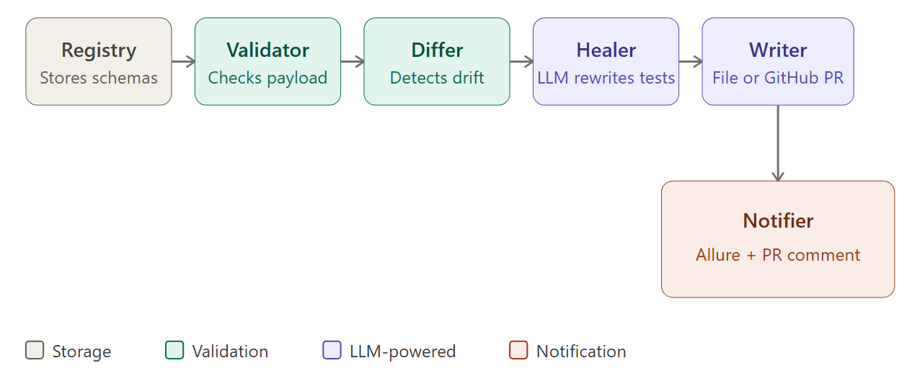

# schema-sentinel

> Self-healing schema validation. Detects API drift, generates updated tests automatically.


---

## What is schema-sentinel?

`schema-sentinel` watches your JSON API schemas. When an upstream service changes its payload shape — a field disappears, a type shifts from `string` to `number`, a new field appears — schema-sentinel:

1. **Detects** the drift (field added, removed, type changed, required changed)
2. **Calls an LLM** (Groq or local Ollama) to rewrite your pytest tests for the new schema
3. **Writes** the updated test file locally or opens a **GitHub PR** automatically
4. **Notifies** via Allure HTML report attachment and GitHub PR comment

---

## Quick Start

```bash
# 1. Install
pip install -e .

# 2. Configure
cp .env.example .env
# Edit .env — add your GROQ_API_KEY

# 3. Register the baseline schema
sentinel register airline examples/airline_schema_v1.json

# 4. Simulate drift — register the updated schema
sentinel register airline examples/airline_schema_v2.json

# 5. Inspect the drift
sentinel diff airline

# 6. Validate a payload
sentinel validate airline examples/payload_valid.json
sentinel validate airline examples/payload_drifted.json

# 7. Self-heal — generate updated tests
sentinel heal airline tests/test_airline.py
```

---

## Architecture — 5-Phase Pipeline




| Module | Responsibility |
|---|---|
| `registry.py` | Versioned schema storage in `.sentinel/schemas/` |
| `validator.py` | jsonschema Draft7 validation against latest version |
| `differ.py` | Recursive field-level diff (added/removed/type/required) |
| `healer.py` | LLM prompt construction + Groq/Ollama call |
| `writer.py` | Write test file locally or create GitHub PR |
| `notifier.py` | Allure attachment + GitHub PR comment |

---

## CLI Reference

| Command | Description |
|---|---|
| `sentinel register <name> <path>` | .github/workflows/Register a JSON Schema or raw JSON sample as a new schema version |
| `sentinel validate <name> <payload>` | Validate a JSON payload against the latest registered schema |
| `sentinel diff <name>` | Show field-level drift between the two most recent schema versions |
| `sentinel heal <name> <tests_path>` | Full pipeline: diff → LLM test gen → write output |
| `sentinel list` | List all registered schemas and their version counts |

---

## BYOK — Bring Your Own Key

### Groq (cloud, free tier)

1. Sign up at [console.groq.com](https://console.groq.com) — free API key, no credit card required
2. Set in `.env`:
   ```env
   LLM_BACKEND=groq
   GROQ_API_KEY=gsk_...
   GROQ_MODEL=llama-3.3-70b-versatile
   ```

### Ollama (local, completely free)

1. Install [Ollama](https://ollama.ai) and pull a model: `ollama pull llama3.2`
2. Set in `.env`:
   ```env
   LLM_BACKEND=ollama
   OLLAMA_BASE_URL=http://localhost:11434
   OLLAMA_MODEL=llama3.2
   ```

---

## GitHub Actions Integration

Add schema drift detection to your CI pipeline:

```yaml
# schema-sentinel.yml
name: Schema Sentinel

on:
  push:
    branches: [main]
  pull_request:

jobs:
  sentinel:
    runs-on: ubuntu-latest
    steps:
      - uses: actions/checkout@v4

      - name: Set up Python
        uses: actions/setup-python@v5
        with:
          python-version: "3.11"

      - name: Install schema-sentinel
        run: pip install -e .

      - name: Run tests with Allure
        run: pytest tests/ -v --alluredir=allure-results
        env:
          GROQ_API_KEY: ${{ secrets.GROQ_API_KEY }}

      - name: Upload Allure results
        uses: actions/upload-artifact@v4
        with:
          name: allure-results
          path: allure-results/
```

---

## Project Structure

```
schema-sentinel/
├── pyproject.toml
├── .env.example
├── sentinel/
│   ├── cli.py          # Typer CLI
│   ├── config.py       # pydantic-settings config
│   ├── registry.py     # Versioned schema storage
│   ├── validator.py    # Payload validation
│   ├── differ.py       # Drift detection engine
│   ├── healer.py       # LLM test generator
│   ├── writer.py       # Local / GitHub PR writer
│   ├── notifier.py     # Allure + PR comment notifier
│   └── models.py       # Shared Pydantic models
├── tests/
│   ├── conftest.py
│   ├── test_registry.py
│   ├── test_validator.py
│   ├── test_differ.py
│   └── test_healer.py
├── examples/
│   ├── airline_schema_v1.json
│   ├── airline_schema_v2.json
│   ├── payload_valid.json
│   └── payload_drifted.json
└── generated_tests/    # Auto-generated test files (gitignored)
```

---

## Contributing

1. Fork the repo
2. Create a feature branch: `git checkout -b feat/my-feature`
3. Install dev dependencies: `pip install -e ".[dev]"`
4. Run tests: `pytest tests/ -v`
5. Open a PR

---

## License

MIT — see [LICENSE](LICENSE) for details.
